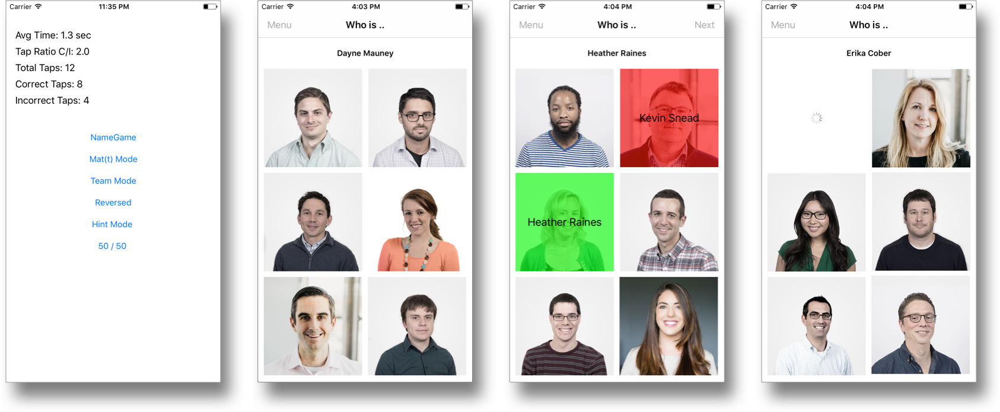
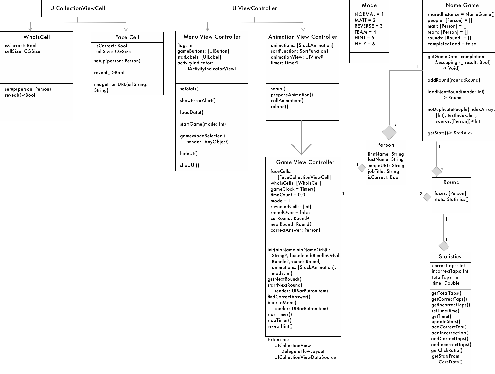

# Name Game Example #
If your're viewing the project from a downloaded version please click [GitHubLink](https://github.com/MrZachChandler/NameGame) for better readablity of this document.

My version of the Name Game. This is an example application to view my style of software development. I tried to include examples of some major programming/iOS practices like: Recursion , Inheritance, Extensions, Protocols, Views From Nib, MultiThreading, Singletons, Core Data, Classes, Structures, CocoaPods, Linked Frameworks, Constants, Pass-By-Value, Pass-By-Reference, URL Sessions, Object Oriented Programming. I do admit that it was rather challenging implementing this in under 8 hours. I took a couple hours longer to refactor and write this README. 

Special thanks Sketch for making this photo in under a minute.

## Getting Started

### Dependency Management

#### CocoaPods

 I committed the installed dependencies to my repo, instead having each developer running `pod install` after a fresh checkout or clone.

Note, you'll need to open the `.xcworkspace` file instead of `.xcproject`, or your code will not compile.

'pod update'

will update all pods to the newest versions permitted by the Podfile.

##### Alamofire
I used Alamofire to complete the inital http request to access your backend service. Although, for image loading I used URLSession.shared.dataTask to illuminate competency using third-party dependencies or included Swift resources.

##### SwiftyJSON
This is used as an easy way to parse the JSON returned by my Alamofire request. It greatly increases readability within my request.

#### Carthage
I recently built an app out of hope that someone at WillowTreeApps would notice, I had added Spruce to my Carthage file before that project and when I was linking the framework I copied the resource to my project. This makes the Spruce package appear in Xcode, this is not the correct way to add it, but due to time I left it in the project. Consequently, it impacts my built time becauce it has to create the binary. Luckily, Spruce is already light weight.

##### Spruce
I used the Spruce example project to create an AnimationViewController, which is inherited by my GameViewCrontrller. This spruces up the transition between rounds and gives a better experience that user is progressing forward in the game even through they are staying on the same screen.
I added a function called reload(). It is called from inside callAnimation() during completion of DispatchQueue.main.async. When I override this function in GameViewController. I can control the timing of replacing curRound with the nextRound. I did this so the animation and reloading the collectionView with new data can happen synchronously.

## Project Structure

### MVVM/MVC

I used a MVVM Design Pattern in mind when constructing this project. Although, my GameViewController does not technically own my NameGame class(the ViewModel). The NameGame class is a Singleton becuase it supplies not only GameViewController, but MenuViewController with the neccessary information to update the view. This helps decouple my codebase. I still manipulate Rounds within my GameViewController. I add the current round's Statistics, taps and time. That model manipulation is typically a MVC standard, but it has no effect on the view. At the end of each round, I append the curRound to the shared instance of NameGame.  

At the start of each round, I load the next round from FaceGame to prepare. My original idea was to start loading the images for the next round in the background during the current round so each round would be preloaded and ready to view. I did not implement this feature due to time, but would be a great way to increase user experience.

## Classes and Structures

### Modes

Modes are global constants used to translate the game type when loading rounds from NameGame and creating the view in GameViewController
*   NORMAL = 1
*   MATT = 2
*   REVERSE = 3
*   TEAM = 4
*   HINT = 5
*   FIFTY = 6
    * This mode is used for my own idea for a game type, where you have one guess and a 50/50 chance.

### Class NameGame

#### Instance Variables

*   static sharedInstance = NameGame()
    *   Creation of the Singleton object
*   people: [Person] = []
    *   Source of all the people in the company with valid information: loaded from Alamofire request
*   matt: [Person] = []
    *   Source of all the people in the company with Mat(t) in their first name: loaded from Alamofire request
*   team: [Person] = []
    *   Source of all the people in the company with valid job title: loaded from Alamofire request
*   rounds: [Round] = []
    * List of the rounds during a current game, destroyed at the end of the game to create statistics
*   completedLoad = false
    * Boolean value used to determine when the data from server has finished loading
*   statistics = Statistics()
    * The NameGame's lifetime running statistics of the player

#### Functions
*   fileprivate override init()
    * calls super for NSObject and calls getDataFromCoreData()
*   func getGameData(completion: @escaping (_ result: Bool) -> Void)
    * Returns: bool based off of success of the request.
    * Uses Alamofire to load the data from the Willow Tree API 
*   func addRound(round:Round)
    * appends a round to the array of Rounds
*   func loadNextRound(mode: Int) -> Round
    * Param: MODE
    * Returns: The next round for the view
    * Uses MODE to determine the source of people for the round, then chooses random people from the source and calls func noDuplicatePeople(indexArray, testIndex ,source)
#### Note
*   func noDuplicatePeople(indexArray: [Int], testIndex:Int ,source:[Person])->Int
    * Param: indexArray to be tested, the int to be tested, and source of people to find the count
    * Returns: an int that is unique
    * This is a recursive function that if the testIndex equals another element in the indexArray, it makes a recursive call on a subArray of the indexArray. The subArray is created by every loop iteration it adds a new element from the indexArray that has been checked already. If a match occurs the subArray is used so that the function that made the original call does not reiterate over already checked elements. Each nested call shrinks the problem size down so that upon the return it only has the remaining members of the indexArray to check. 
    * Upon evaluation worst case is still O(n^2), but the larger the source length is the function begins to approach constant time. The probability of matches decrease exponentially. In this scenerio, MATT is the worst case scenerio becuase the source has a range of 7 and (6 = n) elements are needed. That makes the probability really high that matches will occur. I have dubbed this the MATT Problem.  
    * So I made a solution that is O(n) rather than O(n^2). How it works is an array of indices that correlate with the length of the source. When a random index is chosen the number is removed from the indices and used as the index for the source. It loops until there is n random indices are filled. 
    * The more I think about this problem the probability of a matching random number decreases as the source length increases past N. There must be a point in time when the probability is low enough to switch from the MATT Solution to noDuplicatePeople. Not to mention if the solution length was to large then it would take to much time to create a new array of indices, something to note. 

*   getStats() -> Statistics
    * Returns: Statistics of the current gaame
    * This function also destroys all of the current game's rounds and updates its stats with the combined new rounds
*   updateStats()
    * Saves the context to Core Data and creates it if it does not exist yet
*   getStatsFromCoreData()
    * gets the context to Core Data

### GameViewController: AnimationViewController 

#### Extensions
*   UICollectionViewDelegateFlowLayout
*   UICollectionViewDataSource

#### Instance Variables

#### Note
Since classes are Pass-By-Reference - by keeping a reference to the current UICells I can update the cells without reloading the data for the collectionViewCell
*   faceCells: [FaceCollectionViewCell] = []
*   whoIsCells: [WhoIsCell] = []

*   collectionView: UICollectionView!
*   gameClock = Timer() 
*   timeCount = 0.0
*   mode: Int
*   revealedCells: [Int] = [0,0,0,0,0,0]
    * These track tapped cells to stop duplicate reveals/taps
*   roundOver = false
*   curRound: Round?
*   nextRound: Round?
*   correctAnswer: Person?

#### Functions

*   init(nibName nibNameOrNil:String?, bundle nibBundleOrNil:Bundle?,round: Round, animations: [StockAnimation],mode:Int) 
*   getNextRound() 
*   startNextRound(sender: UIBarButtonItem)
*   findCorrectAnswer()
*   backToMenu(sender: UIBarButtonItem)
*   startTimer()
*   stopTimer()
*   revealHint()

### AnimationViewController

#### Instance Variables

*   animations: [StockAnimation]
*   sortFunction: SortFunction?
*   animationView: UIView?
*   timer: Timer?

#### Functions

*   setup()
*   prepareAnimation()
*   callAnimation()
*   reload()

### Statistics

#### Instance Variables

*   correctTaps = 0
*   incorrectTaps = 0
*   totalTaps = 0
*   time = 0.0

#### Functions

*   addCorrectTap()
*   addIncorrectTap()
*   addCorrectTaps(taps: Int)
*   addIncorrectTaps(taps: Int)
*   getTotalTaps() -> Int
*   setTime(time: Double)
*   getTime() -> Double
*   getClickRatio() -> Double
*   getCorrectTaps()-> Int
*   getIncorrectTaps()-> Int

### struct Person 

#### Instance Variables

*   firstName = ""
*   lastName = ""
*   imageUrl = ""
*   jobTitle = ""
*   isCorrect = false

### struct Round

#### Instance Variables

*   stats = Statistics()
*   faces: [Person] = []

### MenuViewController

#### Instance Variables

*   flag: Int
*   gameButtons: [UIButton]
*   statLabels: [UILabel]
*   stats: Statistics
*   activityIndicator: UIActivityIndicatorView! 

#### Functions

*   setStats()
*   showErrorAlert()
*   loadData()
*   startGame(mode: Int)
*   gameModeSelected (sender: AnyObject)
*   hideUI()
*   showUI()

### FaceCollectionViewCell

#### Note
These collection view cells obviously are super similar, they should inherit from a custom super class.

#### Instance Variables
*   isCorrect: Bool
*   cellSize: CGSize
*   imageView: UIImageview
*   nameLabel: UILabel

#### Functions

*   setup(person: Person)
*   reveal()->Bool
*   imageFromURL(urlString: String)
    * Background fetch updates main thread after completion

### WhoIsCell

#### Instance Variables

*   isCorrect: Bool
*   cellSize: CGSize
*   nameLabel: UILabel

##### Functions

*   setup(person: Person)
*   reveal()->Bool

##TODO:
### Unit Testing
*   Testing: Unit and UI Testing are essential to application development. 
*   Testing Should Include: Bounds, Input, Output, Interactive UI Elements, and all scenerios for all functions

